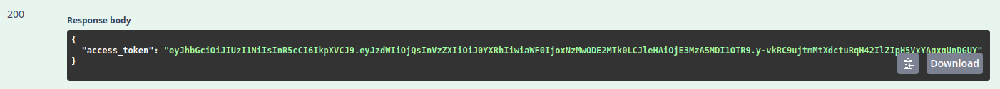

# 📜 API manual

[🔗 Access to the API Documentation](#access-to-the-api-documentation)  
[🚶 Step by Step Tour](#step-by-step-tour)  
- [🟢 Step 1: Access the API Documentation](#step-1-access-the-api-documentation)  
  - [📍 Navigate to the API Documentation](#navigate-to-the-api-documentation)  
- [🟡 Step 2: Understand the Endpoints](#step-2-understand-the-endpoints)  
  - [🔍 Browse the Available Endpoints](#browse-the-available-endpoints)  
- [🔵 Step 3: Make a Test Request with Swagger UI](#step-3-make-a-test-request-with-swagger-ui)  
  - [✍️ Create an Account](#create-an-account)  
  - [📧 Valid Mail Address](#valid-mail-address)  
  - [🔐 Login](#login)  
  - [ℹ️ Get Your Information](#get-your-information)  
  - [🔄 Use the API](#use-the-api)  

[⚠️ Handle Errors](#handle-errors)  
[🔗 How the Routes Are Structured](#how-the-routes-are-structured)  
[📚 More Information to Understand the API](#more-information-to-understand-the-api)  

---

# 🔗 Access to the Api Documentation

By default you can access API documentation at `https://$BACKEND_HOST/api` with :

# 🚶 Step by Step tour

## 🟢 Step 1: Access the API Documentation
### 📍 Navigate to the API Documentation:
Open your web browser and go to the URL for the Swagger documentation: `https://$BACKEND_HOST/api`.

## 🟡 Step 2: Understand the Endpoints
### 🔍 Browse the Available Endpoints:

Swagger organizes endpoints by functionality, with each group representing different features or resources in your API (Auth, link-group-project, Tags etc...).

For each endpoint, you’ll see:
- Description: A brief overview of what the endpoint does.
- Method: The HTTP method (e.g., GET, POST, PUT, DELETE).
- Parameters: Any data or identifiers required for the endpoint (such as IDs).
- Response Examples: Expected responses, including data structure and status codes.

## 🔵 Step 3: Make a Test Request with Swagger UI

### ✍️ Create an Account 

- Go to the the [POST] `/link-user-group/user`
- extend it with the left arrow
- click `Try it out`
- change `mail` - `name` - `password`
- Click `Execute`

### 📧 Valid mail adress

- Confirm your email address by clicking the link sent to your inbox.

### 🔐 Login 
- Go to the [POST] `/auth/login`
- extend it with the left arrow
- click `Try it out`
- Change the `mail` to the `mail` you used on the `Create an Account` section
- Change the `password` to the `password` you used on the `Create an Account` section
- Click `Execute`

The response should display an `access_token`

- Add the token into the [Authorize] section at the top right of the documentation 

### ℹ️ Get your informations 

- Go to the [GET] `/auth/profile`
- extend it with the left arrow
- click `Try it out`
- Click `Execute`

### 🔄 Use the Api
Create a project :
- Go to the [POST] `/link-group-project/project`
- extend it with the left arrow
- click `Try it out`
- Change the `id` to the id displayed by the `auth/profile response`
- Click `Execute`

:1st_place_medal:  you have created your own project ! 

Find another user information : 

- Go to the [GET] `/link-user-group/looking-for-user/{partialString}`
- extend it with the left arrow
- click `Try it out`
- Change the `partialString` to the user's name that you're looking for
- Click `Execute`

Share The project previously created to the user previously found : 

- Go to the [POST] `/link-group-project/project/add`
- extend it with the left arrow
- click `Try it out`
- Change the `projectId` to the project previously created
- Change the `groupId` to the user's userGroup Id that you previously retrieve from the looking for user request
- Click `Execute`

:partying_face: Well done ! 

Use curl to make a request : 

`curl -X GET "https://$BACKEND_HOST/api`\
`-H "Authorization: Bearer your_token_here" `\
`-H "accept: application/json"`

# ⚠️ Handle Errors
If an error occurs, the response will include a status code and error message:

- 400: Bad Request – check parameters or data structure.
- 401: Unauthorized – make sure you’re logged in or include the correct token.
- 404: Not Found – double-check the endpoint and resource IDs.
- 500: Contact support immediately

# 🔗 How the routes are structured 

Most of the routes are named with this logic : 

if you want to use/impact `entity A` or `B` it's mostly on the road `link-A-B/ActionYouWantToPerform`

# 📚 More information to understand the API

Each user on the platform have there own `userGroup`, and this `userGroup` is used to link the `user` to other `entities`. So If you want to share a `media` to another user you need his `userGroupId`

