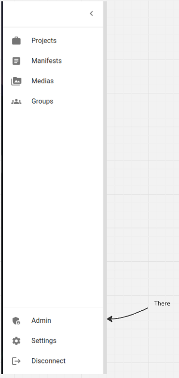
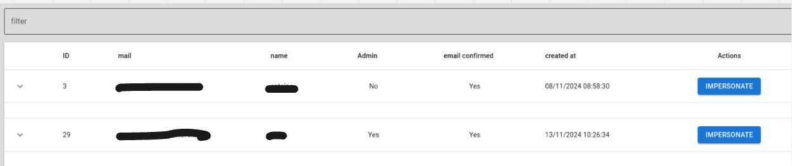

# 📘 Admin Manual Table of Contents

[🚀 Installation](#installation)  
[🐳 Docker Stack Overview](#docker-stack-overview)  
[📖 Introduction](#introduction)  
[🏗 The Stack](#the-stack)  
[⚙️ Environment Configuration](#environment-configuration)  
[📂 Supporting Files](#supporting-files)  
[🚢 Deploy](#deploy)  
[✅ Check If Your Services Are Up](#check-if-your-services-are-up)  
[👑 Promote User to Admin](#promote-user-to-admin)  
[🔄 Impersonate User](#impersonate-user)  
[🗄 Access Database](#access-database)  
[📜 Logs](#logs)  

---

# 🚀 Installation 

MMU have two installation mode (Dev and Prod), see README https://github.com/TETRAS-IIIF/mirador-multi-user.

# 🐳 Docker stack overview
## 📖 Introduction
This Docker stack setup includes a multi-service environment using docker-compose to orchestrate containers for development and production. The stack is designed to handle different environments with ease by utilizing multiple configuration files and environment variables.
Services in docker-compose File

## 🏗 The stack
1. Database (MariaDB)
Image: mariadb:latest
Handles data persistence for the application.

2. Frontend (Node.js 20 Alpine)
Image: node:20-alpine
A lightweight Node.js environment for serving the frontend application.

3. Backend (Node.js 20 Alpine)# 
Image: node:20-alpine
Lightweight environment for running the backend logic.

4. Caddy
Image: caddy
Serves as a lightweight web server to expose files and applications.

Environment Configuration (.env)

## ⚙️ Environment configuration

A `.env` file is used to manage environment variables, including the COMPOSE_FILE variable, to define the stack configuration dynamically.

### 📂 Supported COMPOSE_FILE files 
* `port.yml` : Exposes container ports to the host system.

``` 
version: "3.8"
services:

  db:
    ports:
      - "${DB_EXPOSE_PORT}:3306"

  backend:
    ports:
      - "${BACKEND_PORT}:3000"
      - "9229:9229"

  frontend:
    ports:
      - "${PORT}:4000"

  caddy:
    ports:
      - "${CADDY_PORT}:80"
```

* `dev.yml` : Configures development volumes for live reloading and data persistence.
```
version: "3.8"
services:

    backend:
      volumes:
        - ./backend/.:/app
        - ./backend/node_modules:/app/node_modules
      command: npm run start:debug

    frontend:
      volumes:
        - ./frontend/.:/app/
        - ./frontend/node_modules:/app/node_modules
```

* `prod.yml` : Configures volumes for production, focusing on stability and performance.
```
version: "3.8"
services:
    frontend:
      environment:
        - ENV=PROD
    backend:
      volumes:
        - ${HTTP_FOLDER}:/app/upload
```

* `traefik.yml` : Configures Traefik as a reverse proxy for the production environment.

```
services:
  frontend:
    networks:
      - default
      - traefik
    labels:
      - "traefik.enable=true"
      - "traefik.docker.network=traefik"
      - "traefik.http.routers.${NAME}.rule=Host(`${HOST}`)"
      - "traefik.http.routers.${NAME}.tls.certresolver=myresolver"
      - "traefik.http.routers.${NAME}.entrypoints=web,websecure"
      - "traefik.http.routers.${NAME}.middlewares=hardening@docker"

  backend:
    networks:
      - default
      - traefik
    labels:
      - "traefik.enable=true"
      - "traefik.docker.network=traefik"
      - "traefik.http.routers.${BACKEND_NAME}.rule=Host(`${BACKEND_HOST}`)"
      - "traefik.http.routers.${BACKEND_NAME}.tls.certresolver=myresolver"
      - "traefik.http.routers.${BACKEND_NAME}.entrypoints=web,websecure"
      - "traefik.http.routers.${BACKEND_NAME}.middlewares=hardening@docker"

networks:
  traefik:
    external: true
```

This Docker stack is modular, efficient, and environment-aware. The use of multiple configuration files (port.yml, dev.yml, prod.yml, traefik.yml) allows for flexibility while the .env file ensures easy management of deployment settings. It facilitates a robust workflow for both local development and scalable production setups.

# 🚢 Deploy
Find the documentation to deploy in readme.md there : https://github.com/SCENE-CE/mirador-multi-user?tab=readme-ov-file#mirador-multi-user
## ✅ Check if your service are up : 

- Backend should respond with : "Hello world !"
- Frontend should respond with home page
- Caddy should respond with a `502 : bad gateway` ( this is intended to avoid people to navigate into caddy's files)
# 👑 Promote user to admin

1 - Connect to mariadb container using 
```
docker-compose exec db /bin/bash
```
2 - Then exec : 
```
mariadb -uroot -p
```
3 - Promote user : 
```
UPDATE multiUsers.`user` SET `_isAdmin` = 1 WHERE id = <USER ID>
```

If you want to revocke the Admin status execute stape 1 and 2 ans then : 
```
UPDATE multiUsers.`user` SET `_isAdmin` = 0 WHERE id = <USER ID>
```

# 🔄 Impersonate user

To impersonate user you must be an admin, follow the steps from _Promote user to admin_ section. 

1 - Connect to you admin account on arvest login interface

2 - click on Admin in your left panel 


3 - Find a user to impersonate ( you can use the filter field at the top )

click on the "IMPERSONATE" button

# 🗄 Access database

To access db you must config `.env` `COMPOSE_FILE `variable to add `port.yml`
`COMPOSE_FILE=docker-compose.yml:prod.yml:traefik.yml`

then you can configure any GUI like dbeaver to access it

# 📜 Logs

you'll find backend logs ( level depends on your .env config LOG_LEVEL) into `mirador-multi-user/backend/dist/src/utils/logs/app.log`

you can configure logs level into .env file :
```
# 0 = ERROR, 1 = WARN, 2 = DEBUG, 3 = LOG, 4 = VERBOSE
LOG_LEVEL=0
```

You can also access logs of any service ( frontend - db - backend - caddy ) by using the command `docker-compose logs <name-of-your-service>` into `./mirador-multi-user`

