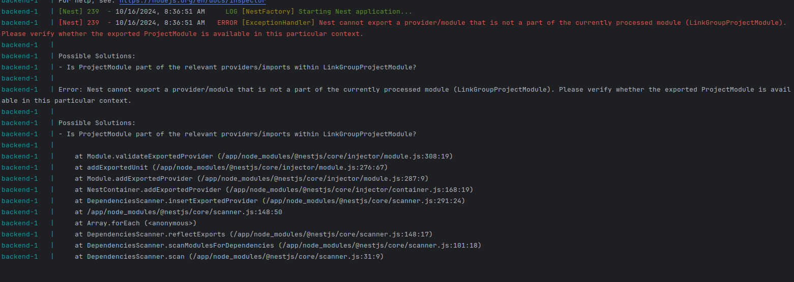
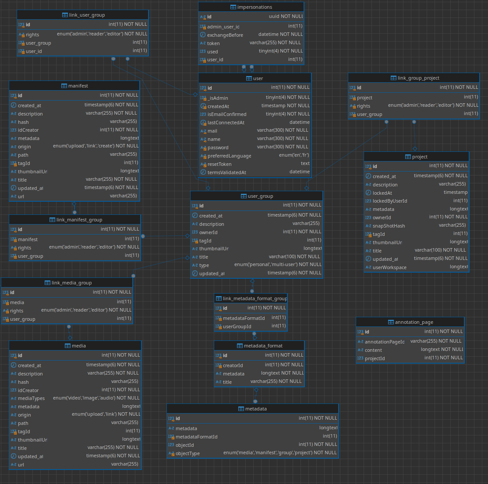

# 💻 Developer manual

[🛠 Technology Overview](#technology-overview)  
- [🐳 Docker](#docker)  
- [⚙️ Docker Compose Orchestration](#docker-compose-orchestration)  
- [🌐 React](#react)  
- [🚀 NestJS](#nestjs)  
- [🗄 MariaDB](#mariadb)  

[🏗 Setup Development Environment](#setup-development-environment)  
- [🟢 NVM](#nvm)  
- [🔄 Hot Reload](#hot-reload)  

[📂 Code Folders Overview](#code-folders-overview)  
- [📦 Backend](#backend)  
- [📁 Src](#src)  
- [💻 Frontend](#frontend)  

[📜 Guidelines](#guidelines)  
- [🔄 Avoiding Circular Dependencies with NestJS and LinkTable](#avoiding-circular-dependencies-with-nestjs-and-linktable)  

[🕰 Historic](#historic)  
- [🔍 Snippet of Code Showing the Problem](#snippet-of-code-showing-the-problem)  
- [📊 Scheme](#scheme)  

[📦 Database Migrations](#database-migrations)  
- [📜 Create a Migration](#create-a-migration)  
- [▶️ Execute Migrations](#execute-migrations)  
- [⚠️ Recreate DB in Development (Do NOT Do This in PRODUCTION)](#recreate-db-in-development-do-not-do-this-in-production)  

[👑 Promote a User to Administrator of the Platform](#promote-a-user-to-administrator-of-the-platform)  

---

# 🛠 Technology Overview

## General scheme


## 🐳 Docker

Docker is an open-source platform designed to develop, ship, and run applications in isolated environments called containers. Containers bundle an application with all its dependencies, ensuring consistency across various environments (development, testing, production, etc.).

Documentation: https://docs.docker.com/

### ⚙️ Docker compose orchestration
 
Docker Compose is a tool for defining and managing multi-container Docker applications. It uses a YAML file to configure application services, allowing developers to start all the required containers with a single command.

Documentation: https://docs.docker.com/compose/


## 🌐 React

React is a popular open-source JavaScript library developed by Facebook for building user interfaces (UI), particularly for single-page applications (SPAs). It allows developers to create reusable UI components, ensuring efficient and dynamic rendering of content.

We choose this to match the technology choice made by Mirador. 

Documentation: https://react.dev/

## 🚀 NestJS

NestJS is a progressive, open-source Node.js framework for building scalable and maintainable server-side applications. It is built with TypeScript and heavily inspired by Angular's architecture, making it modular, extensible, and easy to organize.

Documentation:https://docs.nestjs.com/

## 🗄 MariaDB
MariaDB is an open-source, high-performance relational database management system (RDBMS). It is a fork of MySQL, created to remain free and community-driven. Known for its speed, scalability, and security, MariaDB is widely used for web applications, enterprise software, and embedded systems.

Documentation: https://hub.docker.com/_/mariadb

# 🏗 Setup development environment

## 🟢 NVM

You'll need node 20 to run MMU. You can use nvm (Node Version Management) to handle node versioning : https://github.com/nvm-sh/nvm

## 🔄 Hot reload

You will have access to hot reload thanks to Docker's volume system set up

# 📂 Code folders overview

## 📦 Backend 


At the root of the folder, you will find the Dockerfile and the entrypoint.sh file, which contains the startup instructions for the backend container.

You'll find the migrations folder, where all changes made to the entities and applied to the database will be stored. For more informations on this go to this section : https://github.com/SCENE-CE/mirador-multi-user/wiki/Developer-manual#recreate-db-in-development-do-not-do-this-in-production

You will also find the upload folder where all the medias, manifests and mirador configuration will be stored in file system

### 📁 Src 

The src folder contains all the backend code. I will not cover the NestJS-related implementations here; if you want to learn more about that, please refer to the NestJS documentation.

You will find the "basic" entities in the BaseEntities folder and the "link" entities in the linkEntities folder. To learn more about the implementation of "basic" and "link" entities, please refer to this section: https://github.com/SCENE-CE/mirador-multi-user/wiki/Developer-manual#recreate-db-in-development-do-not-do-this-in-production

## 💻 Frontend 


The purpose of this section is not to cover the implementations related to Vite or React; please refer to their documentation for more information.

Here, as with the backend, you will find the Dockerfile and the entrypoint.sh file at the root of the project.

You will also find the following folders:

- _components_ : Contains all the reusable components of the project.
- _features_ : Contains the code related to the various features of mirador-multi-users.
- _routes_ : Includes two important files:
- _protectedRoutes.tsx_ : Routes accessible once your user is authenticated.
- _publicRoutes.tsx_ : Routes accessible publicly.

# 📜 Guidelines 

## 🔄 Avoiding circular dependencies with nestJS and linkTable

We have implement linkTable with one to many relation with over entities, this allow us to define rights for the entity A on entity B
But this introduce circular dependency problem. 
I manage a structure to handle this.But it allow us to import module A and B into the link module but not the linkModule into module A or B. 
Module A and Module B take care of there own logic and Link Module handle the logic that concern A AND B modules.

### 🕰 Historic 
We used to avoid this problem by creating a C module.
This module imported module A & B & Link but this have for side effect to increese code base a lot, we decided to change this into this branch : https://github.com/SCENE-CE/mirador-multi-user/tree/backend-clear-useless-routes

### 🔍 Snippet of code showing the problem : 
Here you can see that we import ProjectModule and UserGroupModule into LinkProjectUserGroupModule 


It result into this error : 

### 📊 Scheme


# Database backend

## Database scheme


## 📦 Database update

- `docker exec -it <name-of-your-backend-container> /bin/sh`
- `npm run typeorm:generate-migration` --name=<nameofmigration> # <nameofmigration>is like addNewFieldInUser
- `npm run typeorm migration:run -- -d ./src/config/dataSource.ts` 

See more : https://orkhan.gitbook.io/typeorm/docs/migrations#how-migrations-work

## ⚠️ Recreate DB in development (do NOT do this in PRODUCTION)

Execute this comands into the backend docker :
- `npm run typeorm:generate-migration --name=db-init`
- `npm run typeorm migration:run -- -d ./src/config/dataSource.ts` 

## 👑 Promote a user to administrator of the platform 
You can't promote a user to admin using the API or the UI.

You need to directly connect to the db and run this SQL request : 
```
UPDATE multiUsers.`user`
SET `_isAdmin` = 1
WHERE id = <Replace this by the user you want to promote id>;

```

