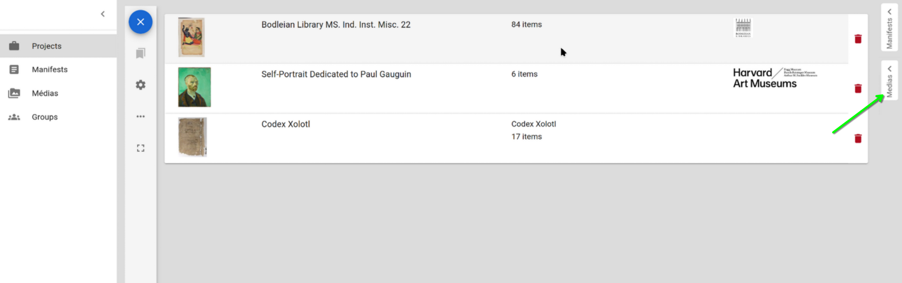

# 📗 User manual table of contents

[👤 Account, Login, and User Preferences](#account-login-and-user-preferences)  
[👥 User Groups](#user-groups)  
[🖼 Media](#media)  
[📜 Manifests](#manifests)  
[📁 Projects](#projects)  
[📝 Annotations](#annotations)  
[🔗 API](#api)  

---
# 👤 Account, login and user preferences

To create an account, you need a valid email address. A confirmation mail is sent to validate your account before your first login.

Once logged in you can edit your user preferences like illustrated in the following screenshot. The preference page includes the following:

* The token to use the API (see https://github.com/SCENE-CE/mirador-multi-user/wiki/API-Documentation)
* Your preferred language (defaults to your browser language, except if specified otherwise)
* Your user informations (name, email and password)
* The button to delete your account

# 👥 User groups

You can create groups of users in order to ease the sharing of your content. 
The group list contains all groups that contain you as member.
The following is accessible in the Group page:

1. Access the group list in the left menu
2. Create new groups
3. Edit existing groups
4. If are member of a group without editing rights, you still can leave it by clicking on the cross
5. Sort the group list
6. Filter the group list

When editing or creating a group, you are prompted with a modal containing:

1. A General tab for basic informations (title, description, etc.)
2. A Member tab to manage members of the group where you can:
3. Search and add users as members
4. Setup member rights regarding the group
5. Save modifications

 

# 🖼 Media

The Media library allows you to manage media that you added or that are shared with you. The following media types are supported:

* Images, uploaded and stored on the platform   
* Images, exposed on the internet and added as URL links
* Videos, exposed on the internet (storing videos directly on the platform is not allowed) with either:
    * A direct link to the video file
    * A Peertube link
    * A Youtube link (if setup by the platform admin)
* Audio is not supported _per say_ but can be added in Peertube or Youtube and treated as video
* All other document types can be uploaded and are available in the OTHER tab.

You can use your media library as follows:

1. Access the Media list in the left menu
2. Tabs to filter media types
3. Filter by title and sort
4. Edit an existing media
5. Copy a media URL
6. Open a media in an external tab
7. Add a new media (either by link or upload)

A media tray is available on the right in every page where you need it. It allows to quicly access your media library and to copy media URLs to use them in manifests or annotations:

# 📜 Manifests
In the IIIF standard, resources can be gathered in composite documents called _manifests_. A manivest is composed of one or several _canvases_. A typical usecase is to recompose a manuscript from the scans of its pages. The "pages" in a manifest are called canvases. It is also possible to compose video contents in manifests.

The Manifest library allows you to manage manifests that you added or that are shared with you. :

You can use your Manifest library as follows:

1. Access the Manifest page in the left menu
2. Filter by title and sort
3. Edit an existing Manifest
4. Copy a Manifest URL
5. Open a Manifest in an external Mirador instance
6. Add a new Manifest (either paste a link, upload a file or create it in an online editor)

A Manifest tray is available on the right in every page where you need it. It allows to quicly access your Manifest library and to copy Manifest URLs to use them in manifests (collections) or annotations:

# 📁 Projects
A Project allows users to present and anotate one or several manifests. Behind the scene, a Project is composed of:

1. A Mirador workspace (a list of manifests and a set of arranged windows),
2. A set of annotations on manifest canvases,
3. A set of settings, like pedefined tags of note templates.

The Project library allows you to manage manifests that you added or that are shared with you. :

You can use your Project library as follows:

1. Access the Project page in the left menu
2. Filter by title and sort
3. Configure an existing Project
4. Open the Mirador workspace of a Project
5. Create a new Project 

Adding manifests to a project is done using the Mirador interface. After opening the Mirador workspace of a Project, click on "START HERE", and then "ADD RESOURCE"

# 📝 Annotations

# 🔗 API

